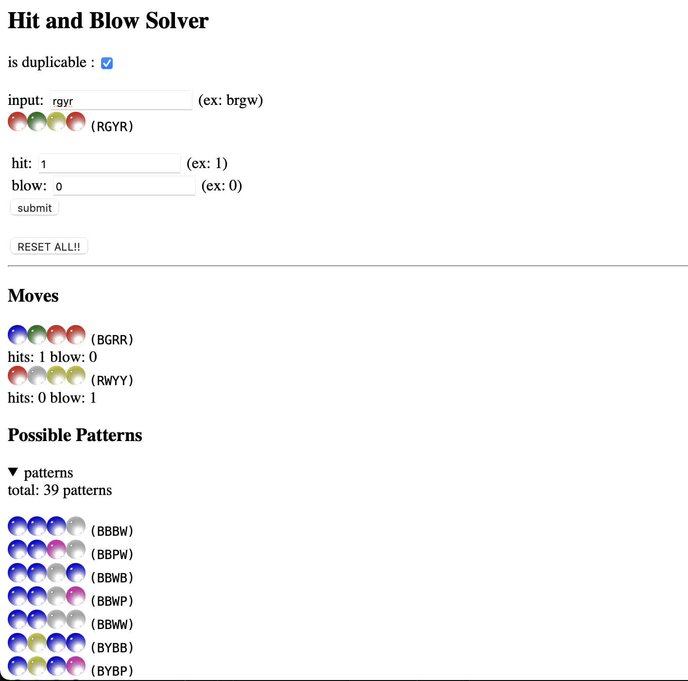

# Hit and Blow (Mastermind) Solver

https://funatsufumiya.github.io/hitandblow-solver-react/

- Solver for [Hit & Blow (known as Mastermind)](https://en.wikipedia.org/wiki/Mastermind_(board_game))
- React App
- TypeScript
- Solver code (currently just `Solver.ts`) and React App is independent
- [Jest](https://jestjs.io/) based test cases

## Usage

- `npm start`
    - Server start on localhost:3000
- `npm run test`
    - Run test cases
- `npm run build`
    - Build static pages

## Algorithm

- On each move, reject patterns which does not match the current move (color set, hit and blow)

## TODO

- Change colors (currently only support R, G, B, Y, P, W)
- Choice assistence of the best move (scoring each moves and looking moves ahead, known as minimax)
- Displaying more info about pattenrs (color appearance rate, occupation rate, etc.) 

## License

MIT License